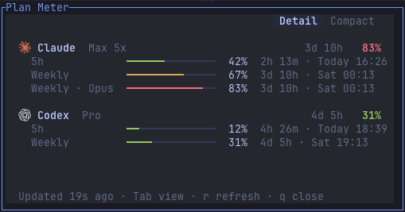
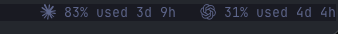

<div align="center">

# Plan Meter

### Claude Code and Codex plan limits, one glance away in herdr.

The limit you are closest to sits in the tab bar. One key opens every window.

[](https://github.com/JunSeo99/herdr-plan-meter/actions/workflows/ci.yml) [](LICENSE)   

**English** · [한국어](README.ko.md)


<br>


<sub>Real usage from a Claude Max 20x and a ChatGPT Plus account, brand icons on.</sub>

</div>

```bash
herdr plugin install JunSeo99/herdr-plan-meter
herdr plugin action invoke junseo99.plan-meter.setup
```

The second command opens a popup with the config snippet for your install. Press `c` to copy it, paste it into `~/.config/herdr/config.toml`, and run `herdr server reload-config`.

## What you get

| Where | What |
|---|---|
| Tab bar | For each plan, the window closest to its limit: percent used and time until it resets. `~` marks a reading older than 15 minutes. |
| Popup (`prefix+u`) | Every window (5-hour, weekly, per-model weekly) with a bar colored by headroom and the reset time on your clock. `Tab` switches Detail/Compact, `r` refreshes, `q` closes. |
| Errors | An expired login, a 429, or a changed response shows in the popup. The last good reading stays in place. |

Only plans you are signed into appear.

Seats metered on credits rather than on time — where the 5-hour and weekly windows
come back empty — show a **Credits** row with the percent of the pool used. A pool
has no scheduled reset, so that row carries no countdown.

**Why another usage plugin?** Plan Meter is one Python file with no dependencies and no build step. It leaves your Claude Code statusLine alone, shows numbers even when no Claude session is running, and only ever reads credentials.

## Setup

1. `herdr plugin install JunSeo99/herdr-plan-meter`
2. `herdr plugin action invoke junseo99.plan-meter.setup`, then press `c`.
3. Paste into `~/.config/herdr/config.toml`. If you already have a `[ui]` table, move the keys into it, because TOML does not allow a second `[ui]`.
4. `herdr server reload-config`

The snippet does three things:

- Adds a `ui.tab_bar_right` entry that runs `tab-bar.sh` in the plugin's config directory.
- Moves the tab bar to the bottom. This is optional: delete that line to keep it on top.
- Binds `prefix+u` to the popup. Several usage plugins use that key, so change it if it clashes.

`tab-bar.sh` is a one-line shim that points at the installed copy of the plugin. herdr's install path for plugins is internal, so Plan Meter rewrites the shim on every herdr start and your config never has to change.

### Refreshing

Usage only moves while an agent works, so Plan Meter refreshes when an agent turn ends (herdr's `pane.agent_status_changed` event), at most every 2 minutes. On top of that it polls every 5 minutes, which catches resets and usage from other machines.

The tab bar redraws from the cache every 15 seconds, so a refresh shows up within seconds. To refresh by hand, press `r` in the popup, or bind the refresh action:

```toml
[[keys.command]]
key = "prefix+shift+u"
type = "plugin_action"
command = "junseo99.plan-meter.refresh"
description = "refresh plan usage"
```

Manual refreshes are limited to one every 30 seconds.

### Options

`$(herdr plugin config-dir junseo99.plan-meter)/config.toml`:

```toml
lang = "auto"   # auto | en | ko. auto follows the macOS UI language, then LANG.
icons = "text"  # text | nerd
```

### Brand icons

`icons = "nerd"` replaces the names with the Claude and OpenAI logos from Nerd Fonts 3.5 (`cod-claude` U+EC82, `cod-openai` U+EC81). Your terminal font needs those glyphs. Ghostty 1.3 bundles an older Nerd Font, so install the symbols font and map the two code points:

```bash
brew install --cask font-symbols-only-nerd-font
```

```ini
# Ghostty config, then reload it (⌘⇧, on macOS)
font-codepoint-map = U+EC81-U+EC82=Symbols Nerd Font Mono
```

## How it works

| | Claude Code | Codex |
|---|---|---|
| Login it reads | The macOS Keychain item Claude Code writes (`Claude Code-credentials-<hash>`), or `~/.claude/.credentials.json` on Linux. Respects `CLAUDE_CONFIG_DIR`. | `$CODEX_HOME/auth.json` (default `~/.codex`) from a ChatGPT sign-in |
| Endpoint | `api.anthropic.com/api/oauth/usage` | `chatgpt.com/backend-api/wham/usage` |
| Windows | 5-hour, weekly, per-model weekly | 5-hour, weekly |

- **Tokens stay put.** Each fetch reads the token, sends it only to that vendor, and forgets it. Redirects are refused, so a token cannot follow a 3xx elsewhere. Plan Meter never writes a token and never refreshes one. Refreshing is the CLI's job, and rotating a refresh token from outside can sign the CLI out. An expired token shows as "Login expired — run Claude Code to renew it".
- **The cache holds numbers only.** `~/.cache/herdr-plan-meter/usage.json` (under `$XDG_CACHE_HOME` if set) has plan names, percentages and reset times. [SECURITY.md](SECURITY.md) lists every file Plan Meter reads and writes.
- **Polite polling.** A file lock stops the tab bar, the popup and the event hook from calling twice. A 429 waits for `Retry-After`, and at least 5 minutes.
- **Why not the statusLine `rate_limits` field?** Claude Code does document it, but it needs a live session and the plugin would have to own your statusLine. It also has no per-model windows.

## Caveats

- **Undocumented endpoints.** Neither vendor documents these usage endpoints, and they can change without notice. When a response stops parsing, the popup says so and keeps the last reading. Please open an issue.
- **A gray area.** Plan Meter sends Claude Code's own OAuth token to Anthropic's usage endpoint, outside Claude Code. It only reads your quota and never makes model requests. Still, check the terms you are under before relying on it.
- **Keychain prompt.** On macOS the first read may ask you to allow access to the Claude Code item.
- Plan Meter is not affiliated with Anthropic, OpenAI or herdr.

## Troubleshooting

| Symptom | Check |
|---|---|
| Nothing in the tab bar | Run `$(herdr plugin config-dir junseo99.plan-meter)/tab-bar.sh` by hand, then check that the snippet is inside your one `[ui]` table. |
| "Login expired" for Claude | Start Claude Code once. It refreshes its own token and the next poll picks it up. |
| A plan is missing | Plans without a subscription login are hidden. API-key logins have no plan limits. |
| A box or a CJK glyph instead of a logo | Your font lacks Nerd Fonts 3.5 glyphs. See [Brand icons](#brand-icons), or set `icons = "text"`. |
| Logs | `herdr plugin log list --plugin junseo99.plan-meter` |

## Update and uninstall

```bash
herdr plugin install JunSeo99/herdr-plan-meter   # reinstall to update
herdr plugin uninstall junseo99.plan-meter
```

After uninstalling, remove the snippet from `config.toml` and delete `~/.cache/herdr-plan-meter`.

## Requirements

- herdr 0.9 or later (popup panes, `tab_bar_right` command entries)
- Python 3.9 or later, standard library only
- macOS or Linux. On Linux, only the sample-data tests run in CI; it has not been tried with a live account.
- Claude Code and/or Codex CLI, signed in with a subscription

## Try it without an account

```bash
PLAN_METER_DEMO=1 python3 meter.py panel
```

Demo mode renders sample data without reading credentials or touching the network.

## Development

```bash
python3 -m unittest discover -s tests -v
herdr plugin link "$PWD"   # use your working tree as the installed plugin
```

## License

[MIT](LICENSE)
